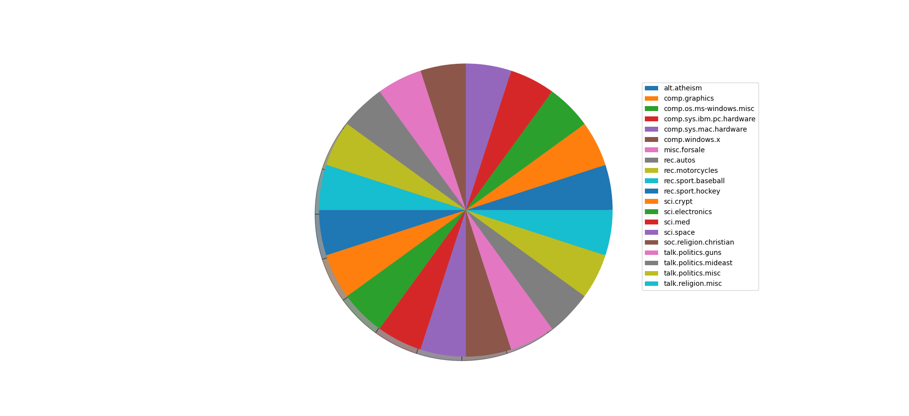

# Natural-Language-Processing-20-Newsgroup-dataset

Various Machine learning models were implemented to classify textual data. The input is text documents and the output is categorical variable (class labels). All the machine learning models were implemented using Scikit learn libraries. The dataset used here in this project is 20-Newsgroup dataset.

# Dataset Information

The 20 newsgroups dataset comprises around 18000 newsgroups posts on 20 topics split in two subsets: one for training (or development) and the other one for testing (or for performance evaluation). The split between the train and test set is based upon a messages posted before and after a specific date. [Dataset information](https://scikit-learn.org/stable/modules/generated/sklearn.datasets.fetch_20newsgroups.html)

# Data Set Characteristics:

    Classes         20

    Samples total   18846

    Dimensionality    1

    Features        text
    

    
    

